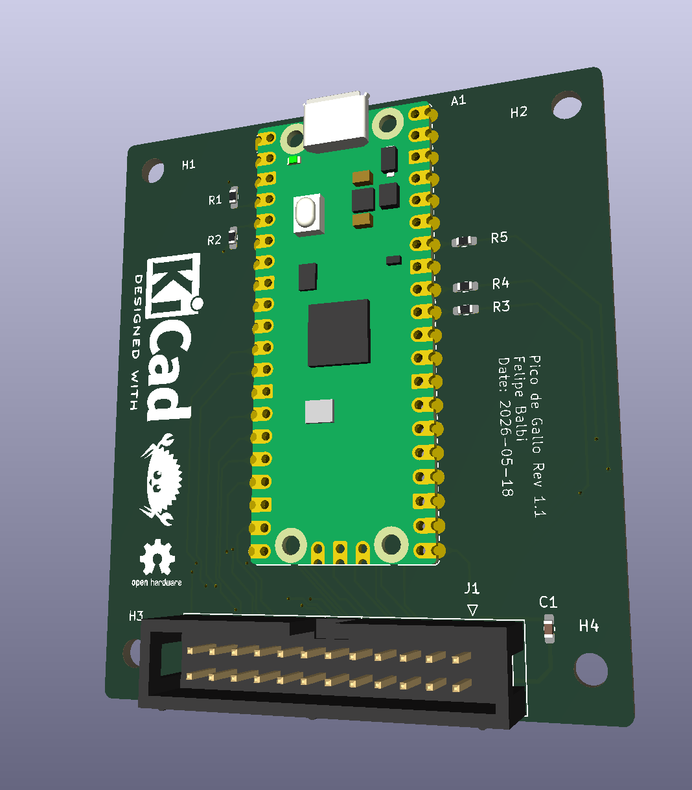

# Introduction

*Pico de Gallo* turns a [Raspberry Pi
Pico 2](https://www.raspberrypi.com/products/raspberry-pi-pico-2/)
into a USB-attached protocol bridge so you can drive **I²C, SPI,
UART, GPIO, PWM, ADC,** and **1-Wire** peripherals from a host PC —
and, more importantly, so you can develop and test embedded
device drivers **on your laptop**, with no flashing, no SWD probe,
no clock or pin-mux setup, and no linker scripts in your way.

If you've ever wanted to:

- prototype a driver against `embedded-hal` traits without booting
  an MCU each time you change a line,
- script a sensor or actuator from Python or a shell one-liner,
- write an integration test that talks to real silicon from your
  CI runner,

then *Pico de Gallo* is for you.

## What's in the Box

A small landing-board PCB with castellated pads for the Pico 2, a
firmware image that speaks
[postcard-rpc](https://docs.rs/postcard-rpc) over USB, and a small
constellation of host-side crates:

- **`gallo`** — a CLI for one-off and scripted access to every
  interface.
- **`pico-de-gallo-lib`** — an async Rust client built on
  [`nusb`](https://docs.rs/nusb) and `tokio`.
- **`pico-de-gallo-hal`** — a host-side
  [`embedded-hal`](https://docs.rs/embedded-hal) /
  [`embedded-hal-async`](https://docs.rs/embedded-hal-async) shim
  so existing drivers work unchanged.
- **`pico-de-gallo-ffi`** — a C shared library with a stable
  opaque-pointer API.
- **`pyco-de-gallo`** — Python bindings via PyO3 and maturin.

<table>
<tr>
<td align="center"> <em>Pico de Gallo v1.0</em></td>
<td align="center"> <em>Pico de Gallo v1.1</em></td>
</tr>
</table>

## Hardware Revisions at a Glance

| Revision | Firmware feature | Connector            | Capabilities                           |
|----------|------------------|----------------------|----------------------------------------|
| **v1.0** | `hw-rev1`        | seven pin headers    | I²C, SPI, GPIO, PWM                    |
| **v1.1** | `hw-rev2`        | one keyed 2×12 box   | I²C, SPI, UART, GPIO, PWM, ADC, 1-Wire |
| v2 (WIP) | `hw-rev2`        | 2×12 box + level Tx  | same as v1.1, plus variable VREF       |

You'll want **v1.1 or later** if you need UART, ADC, or 1-Wire. See
[Revisions: v1.0 vs v1.1](./hardware/revisions.md).

## How to Read This Book

The book is laid out as six parts plus appendices:

1. **The Hardware** — what's on the PCB, which revision to pick,
   how to flash firmware.
2. **Getting Started** — install the toolchain and verify your
   device.
3. **The Interfaces** — one chapter per peripheral. Each follows
   the same template: overview, pin mapping, CLI usage, Rust,
   C, Python, error handling.
4. **The Crates** — reference for each crate in the workspace.
5. **Writing a Device Driver** — the longest part. A TMP102
   walkthrough showing the dev loop, the blocking/async parity, and
   how to write hardware-in-the-loop tests that run on your laptop.
6. **Under the Hood** — the wire protocol, schema versioning,
   firmware architecture, and the release-please cadence.

Read top-to-bottom for a tour, or jump straight to the chapter you
need — each chapter stands on its own.

## The Optional Case

A 3D-printable, snap-fit enclosure lives in the
[`case/`](https://github.com/OpenDevicePartnership/pico-de-gallo/tree/main/case)
folder of the repository if you want to keep the board safe on your
bench.

